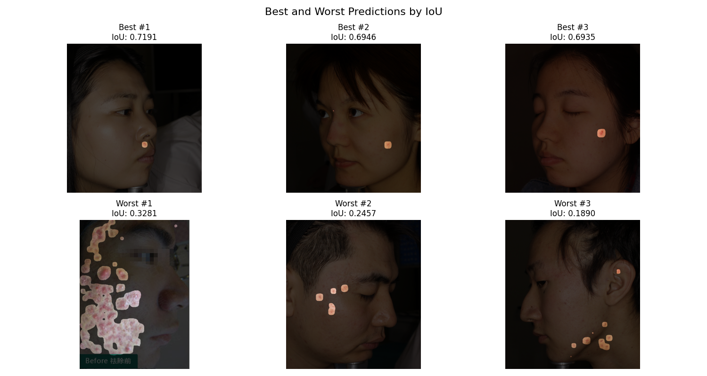
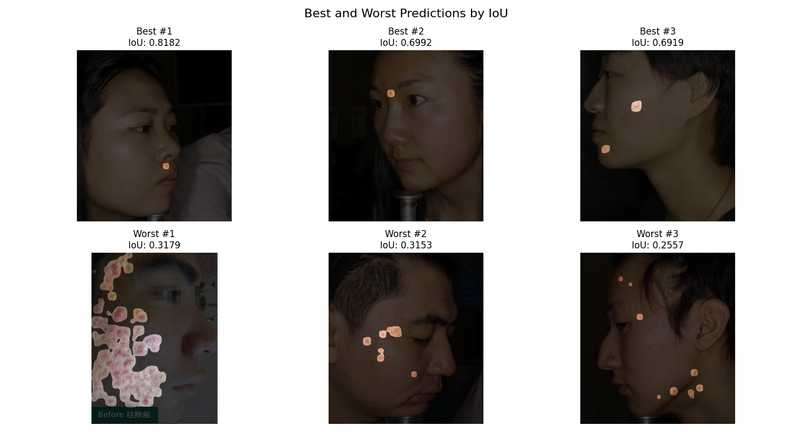
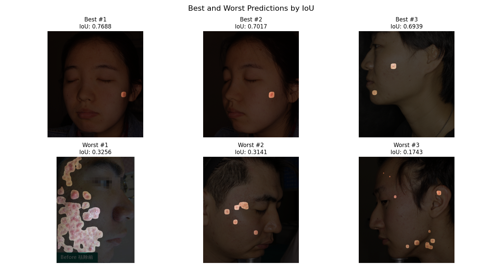
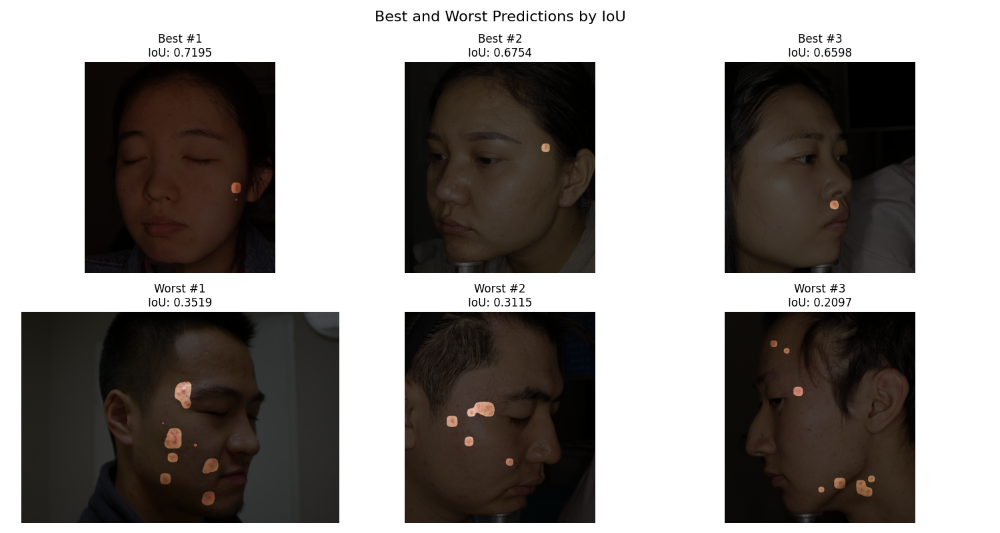
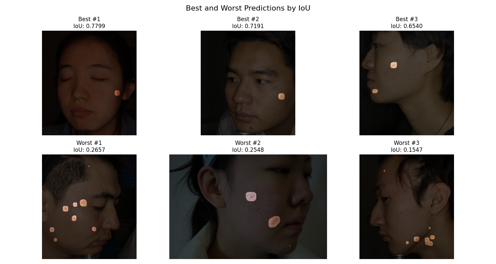
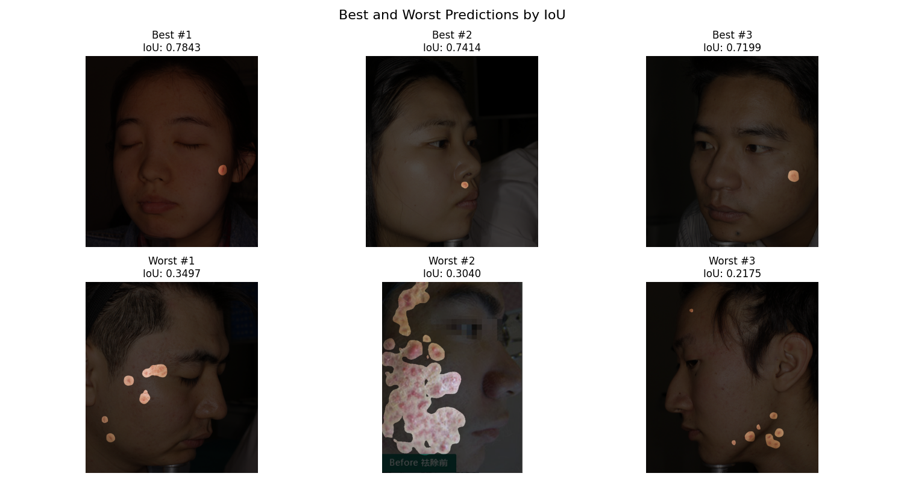
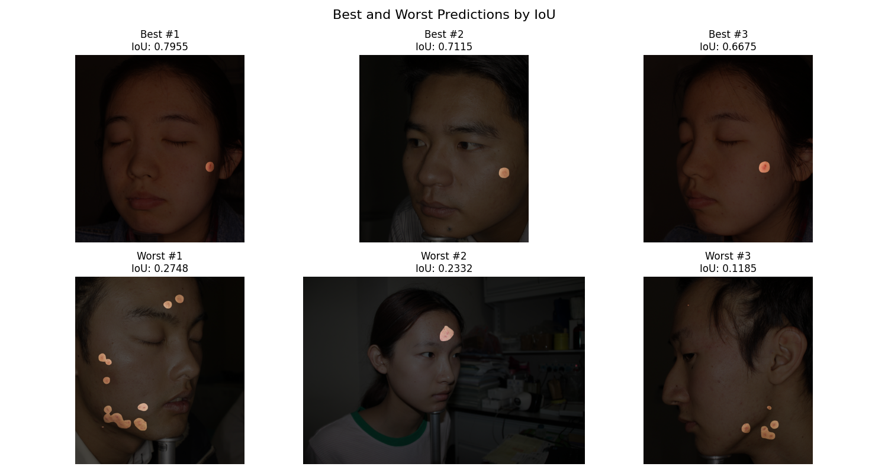

# acne-segmentation

## Install

```sh
conda create -n "AcneSegmentation" python=3.9 -y
conda activate AcneSegmentation

pip install torch torchvision torchaudio
pip install segmentation-models-pytorch opencv-python pandas albumentations tqdm matplotlib transformers
```

## Train

```sh
# Train Unet (efficientnet-b4)
python train_script.py \
    --architecture Unet \
    --unet_encoder efficientnet-b4 \
    --checkpoint ./checkpoint/best_model_unet_efficientnet-b4_epoch78_iou0.4648.pth \
    --epochs 50 \
    --lr 0.00001 \
    --batch_size 8 \
    --img_size 256 256

# Train SegFormer (nvidia/segformer-b1...)
python train_script.py \
    --architecture SegFormer \
    --segformer_model nvidia/segformer-b1-finetuned-ade-512-512 \
    --checkpoint ./checkpoint/best_model_segformer_nvidia_segformer-b1-finetuned-ade-512-512_epoch45_iou0.4737.pth \
    --epochs 50 \
    --lr 6e-5 \
    --batch_size 8 \
    --img_size 512 512
```

## Inference and Evaluation

```sh
# Evaluate a Unet model
python evaluate.py \
    --architecture Unet \
    --unet_encoder mobilenet_v2 \
    --model ./checkpoint/best_model_unet_mobilenet_v2_epoch118_iou0.4578.pth \
    --input_txt ./data/with_mask_test.txt \
    --img_dir ./data/JPEGImages/ \
    --mask_dir ./data/mask/ \
    --output_dir ./results/ \
    --img_size 256 256 \
    --threshold 0.5 \
    --darken 0.3

# Or inference a SegFormer model (no masks given)
python evaluate.py \
    --architecture SegFormer \
    --segformer_model nvidia/segformer-b1-finetuned-ade-512-512 \
    --model ./checkpoint/best_model_segformer_nvidia_segformer-b1-finetuned-ade-512-512_epoch45_iou0.4737.pth \
    --input_txt ./data/with_mask_test.txt \
    --img_dir ./data/JPEGImages/ \
    --output_dir ./results/ \
    --img_size 512 512 \
    --threshold 0.5 \
    --darken 0.3
```

## Results

| Model | Input Dimension | Size | IoU Score (Jaccard) | F1 Score (Dice) | Avg. Inference Time (s) |
| :------------------- | :-------------- | :----- | :------------------ | :-------------- | :---------------------- |
| Unet mobilenet-v2 | 256x256 | 25.5MB | 0.4578 | 0.6280 | 0.0108 |
| Unet efficientnet-b4 | 256x256 | 77.9MB | 0.4648 | 0.6346 | 0.1468 |
| Unet efficientnet-b7 | 256x256 | 257MB | 0.4594 | 0.6296 | 0.0414 |
| Unet resnet34 | 256x256 | 93.3MB | 0.4549 | 0.6253 | 0.0088 |
| Unet resnet50 | 256x256 | 124MB | 0.4500 | 0.6207 | 0.0110 |
| SegFormer-b0 | 512x512 | 14.2MB | 0.4683 | 0.6379 | 0.1346 |
| SegFormer-b1 | 512x512 | 52.2MB | 0.4736 | 0.6428 | 0.0120 |

### Unet Mobilenet-V2

 

### Unet Efficientnet-b4

 

### Unet Efficientnet-b7

 

### Unet Resnet34



### Unet resnet50



### SegFormer-b0

 

### SegFormer-b1


